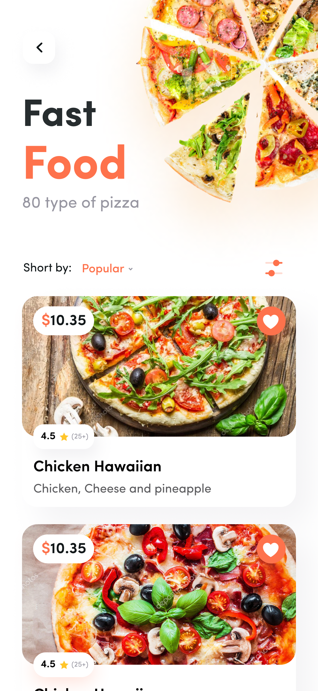
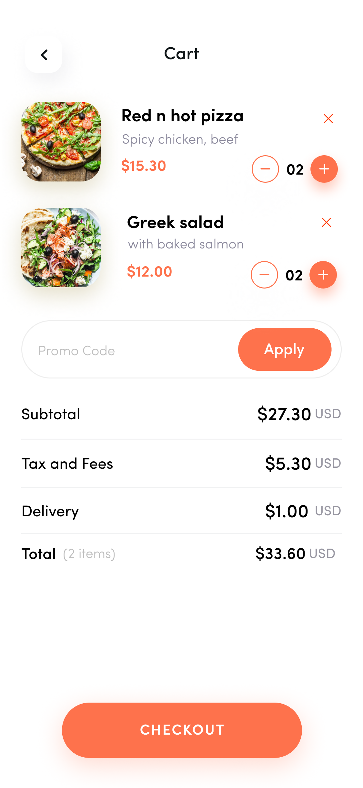

# Flutter Food App

A simple food delivery app built using Flutter by Piyush. The app allows users to explore food categories, select their favorite food and restaurants, manage a cart, and place orders.

## Features

- **Login**: Simple login functionality without backend authentication.
- **Cart**: Add food items to the cart, view them, and manage quantity.
- **Food Categories**: Explore a variety of food categories.
- **Favorite Food**: Mark food items as favorite.
- **Favorite Restaurants**: Mark restaurants as favorite for easy access.
- **Order**: Place orders and view order history.

## Screenshots

Here are some screenshots of the app design:

### 1. Login Page


### 2. Food Categories


### 3. Cart


### 4. Favorites


## Getting Started

### Prerequisites

- Flutter SDK (>= 2.0.0)
- Dart SDK (>= 2.12.0)
- Any IDE supporting Flutter (e.g., Android Studio, VS Code)

### Installation

1. Clone this repository:

    ```bash
    git clone [https://github.com/piro-piyush/food_app.git]
    ```

2. Navigate to the project directory:

    ```bash
    cd food_app
    ```

3. Install dependencies:

    ```bash
    flutter pub get
    ```

4. Run the app:

    ```bash
    flutter run
    ```

## App Structure

...

## Contributing

Feel free to open a pull request or file an issue if you would like to contribute to this project.

## License

This project is licensed under the MIT License.


